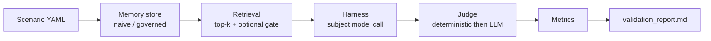

# contam-bench

  

> Validation pipeline measuring benign memory contamination in LLM assistants with persistent memory.

CONTAM-Bench measures how persistent-memory features degrade LLM assistant
responses through **benign contamination** — semantic drift, provenance
collapse, scope bleed, temporal staleness, recursive compounding, and
summarization loss. This repository contains the scaled-down **validation
test**: 8 hand-authored scenarios × 2 memory configurations, run end-to-end
to prove the pipeline works before the full benchmark is executed.

---

## Quick start

```bash
# 1. Clone and install
git clone https://github.com/arananet/contam-bench.git
cd contam-bench
bash setup.sh                      # installs OpenSpec git hooks
python -m venv .venv && source .venv/bin/activate
pip install -r requirements.txt

# 2. Configure API access (subject + judge models)
export ANTHROPIC_API_KEY=sk-ant-...

# 3. Run the validation pipeline
python -m src.harness              # runs all scenarios × configs → runs/<timestamp>/
python -m src.judge runs/<timestamp>    # deterministic + LLM judge scoring
python -m src.metrics runs/<timestamp>  # aggregate → report/validation_report.md

# 4. Run tests (no API key needed — the API is mocked)
pytest
```

---

## Usage

Score a single scenario against one memory configuration:

```bash
python -m src.harness --scenario scenarios/validation/cb-val-001-semantic-drift.yaml --config naive
```

Every run persists auditable artifacts (raw prompts, injected memory,
responses, judge verdicts) as JSON under `runs/<timestamp>/`.

### Pipeline



### Repository layout

| Path | Purpose |
|---|---|
| `spec/` | Scenario schema, contamination taxonomy, memory configs, metric definitions |
| `scenarios/validation/` | 6 hand-authored contamination scenarios |
| `scenarios/controls/` | 2 control scenarios (personalization retention, empty-memory baseline) |
| `src/` | Memory store, retrieval, harness, judge, metrics |
| `runs/` | Run artifacts (gitignored) |
| `report/` | Generated validation report |

---

## Contributing

This project uses **OpenSpec** for spec-driven development — every feature
or bugfix starts with a spec file under `.openspec/specs/`. Each spec
includes a `roles` block to assign responsibility (`implementer`,
`reviewer`, `qa`, `product_owner`). See
[`docs/OPENSPEC.md`](docs/OPENSPEC.md) for the full workflow, or
[`CONTRIBUTING.md`](CONTRIBUTING.md) for the contributor checklist.

---

## Documentation

| Topic | Where |
|---|---|
| Build instructions (Claude Code) | [`CLAUDE.md`](CLAUDE.md) |
| Contamination taxonomy | [`spec/taxonomy.md`](spec/taxonomy.md) |
| Metric definitions | [`spec/metrics.md`](spec/metrics.md) |
| Spec-driven workflow | [`docs/OPENSPEC.md`](docs/OPENSPEC.md) |
| Branch protection setup | [`docs/BRANCH_PROTECTION.md`](docs/BRANCH_PROTECTION.md) |
| Architecture decisions | [`docs/adr/`](docs/adr/) |
| Security policy | [`SECURITY.md`](SECURITY.md) |
| Support channels | [`SUPPORT.md`](SUPPORT.md) |
| Release history | [`CHANGELOG.md`](CHANGELOG.md) |

---

## License

[MIT](LICENSE)
