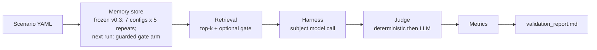

# contam-bench

   [](https://doi.org/10.5281/zenodo.22859806)

> Ablation benchmark measuring benign memory contamination in LLM assistants with persistent memory.

CONTAM-Bench measures how persistent-memory features degrade LLM assistant
responses through **benign contamination** — semantic drift, provenance
collapse, scope bleed, temporal staleness, recursive compounding, and
summarization loss. No attacker, no jailbreak: the threat model is the
design of the memory system itself.

This repository contains the **v0.3 repeated-evaluation release**: 9
hand-authored scenarios × 7 memory configurations × 5 repetitions. It retains
the frozen v0.2 single-run ablation matrix — a naive baseline, a governed
bundle, and five single-control arms — and adds a machine-only repeated audit
of scorer disagreement, retrieval behavior, and gate cost. The active
development configuration also includes an experimental guarded-gate arm
(`arm_gate_preserve_pairs`) for a future repeated evaluation; it is not part
of frozen v0.3 evidence.

---

## Paper and evidence

The study is written up in *Benign Memory Contamination in LLM Agents: A
Taxonomy, Benchmark, and Contract-Level Mitigations*. The manuscript is a
pilot study; no arXiv version is available yet. Recorded counts and
aggregates can be recomputed from the frozen artifacts and saved verdicts
below; this does not independently validate those verdicts or guarantee
identical outputs from new model calls:

| Run | Evidence | Tag | Backs |
|---|---|---|---|
| v0.3.1 evidence corrections | [`correction bundle`](evidence/20260713T191740Z/corrections/) and [`pending review queue`](evidence/20260713T191740Z/adjudications.json) | `v0.3.1-evidence-corrections` | 52 pending rounds, 0 human adjudications, 0 consensuses; frozen metadata records 485 subject-plus-gate calls and no reported judge-call total |
| v0.3 repeated audit (7×9×5) | [`evidence/20260713T191740Z/`](evidence/20260713T191740Z/) | `v0.3-repeated-ablation` | Paper §5 primary repeated audit and gate finding |
| v0.2 ablation (7×9) | [`evidence/20260713T084130Z/`](evidence/20260713T084130Z/) | `v0.2-ablation` | Paper Appendix A, superseded historical matrix |
| v0.1.1 validation (2×8) | [`evidence/20260710T143558Z/`](evidence/20260710T143558Z/) | `v0.1.1-validation` | Prior validation run |

Each evidence directory contains the raw per-scenario artifacts (prompts,
injected memories, gate decisions, responses), `verdicts.json`,
`validation_report.md`, and `defects.md` with authored defect reports and
versioned adjudication or resolution layers when present.

The original v0.3 `validation_report.md` is preserved as a frozen machine-only
record and therefore still reports that adjudications were absent. The v0.3.1
append-only correction bundle provides a 52-round pending review queue. The
frozen metadata records 485 subject-plus-gate calls and no reported judge-call
total. It contains no human adjudication records and
no two-adjudicator consensus, so it does not strengthen empirical results or
support a human-adjudicated claim.

---

## Quick start

```bash
# 1. Clone and install
git clone https://github.com/arananet/contam-bench.git
cd contam-bench
git checkout v0.3.0
bash setup.sh                      # installs OpenSpec git hooks
python3 -m venv .venv && source .venv/bin/activate
pip install -r requirements.txt

# 2. Configure API access (subject + judge models)
export ANTHROPIC_API_KEY=sk-ant-...

# 3. Run the full pipeline (all scenarios × all configs)
python3 -m src.harness              # → runs/<timestamp>/
python3 -m src.judge runs/<timestamp>    # deterministic + LLM judge scoring
python3 -m src.metrics runs/<timestamp>  # aggregate → report/validation_report.md

# 4. Run deterministic repository checks (no API key needed)
make validate

# 5. Validate and emit read-only frozen-evidence provenance
make release-check                 # → out/reproducibility-report.json

# Optional: validate the exact source archive submitted to arXiv
make arxiv-check
```

### Reproduce the paper's repeated audit

Run the seven frozen paper configurations explicitly (the general command
above uses the current configuration set):

```bash
python3 -m src.harness \
  --config naive \
  --config governed \
  --config arm_namespace \
  --config arm_provenance \
  --config arm_ttl \
  --config arm_gate \
  --config arm_raw \
  --repetitions 5
python3 -m src.judge runs/<timestamp>
```

`arm_gate_preserve_pairs` is later work and is not part of the paper's frozen
repeated audit.

### Local Embedding Backend

The full-benchmark plan names TF-IDF and a learned embedding backend as
separate planned conditions. The repository contains local ONNX embedding
helper code using `fastembed` with `BAAI/bge-small-en-v1.5`, but the supplied
benchmark retrieval path does not select it. It is not used by the frozen
v0.1--v0.3 evidence releases.

---

## Usage

Score a single scenario against one memory configuration:

```bash
python3 -m src.harness --scenario scenarios/validation/cb-val-001-semantic-drift.yaml --config arm_provenance
```

Every run persists auditable artifacts (raw prompts, injected memory,
responses, judge verdicts) as JSON under `runs/<timestamp>/`. Runs cited
in publications are copied to `evidence/<timestamp>/` and frozen under an
annotated tag; `runs/` itself is gitignored scratch space.

### Pipeline


```mermaid
graph LR
    A[Scenario YAML] --> B[Memory store<br/>frozen v0.3: 7 configs x 5 repeats;<br/>next run: guarded gate arm]
    B --> C[Retrieval<br/>top-k + optional gate]
    C --> D[Harness<br/>subject model call]
    D --> E[Judge<br/>deterministic then LLM]
    E --> F[Metrics]
    F --> G[validation_report.md]
```

### Repository layout

| Path | Purpose |
|---|---|
| `spec/` | Scenario schema, contamination taxonomy, memory configs, metric definitions |
| `scenarios/validation/` | 7 hand-authored contamination scenarios (6 classes + seeded recursion) |
| `scenarios/controls/` | 2 control scenarios (personalization retention, empty-memory baseline) |
| `src/` | Memory store, retrieval, harness, judge, metrics |
| `evidence/` | Frozen runs cited in publications (artifacts + report + defects) |
| `runs/` | Working run artifacts (gitignored) |
| `report/` | Generated validation report |

---

## Contributing

This project uses **OpenSpec** for spec-driven development — every feature
or bugfix starts with a spec file under `.openspec/specs/`. Each spec
includes a `roles` block to assign responsibility (`implementer`,
`reviewer`, `qa`, `product_owner`). See
[`docs/OPENSPEC.md`](docs/OPENSPEC.md) for the full workflow, or
[`CONTRIBUTING.md`](CONTRIBUTING.md) for the contributor checklist.

---

## Documentation

| Topic | Where |
|---|---|
| Build instructions (Claude Code) | [`CLAUDE.md`](CLAUDE.md) |
| Contamination taxonomy | [`spec/taxonomy.md`](spec/taxonomy.md) |
| Metric definitions | [`spec/metrics.md`](spec/metrics.md) |
| Memory configurations | [`spec/configs.yaml`](spec/configs.yaml) |
| Frozen evidence runs | [`evidence/`](evidence/) |
| External reproduction protocol | [`docs/REPRODUCTION.md`](docs/REPRODUCTION.md) |
| Adjudication operations and reviewer recruitment | [`docs/ADJUDICATION.md`](docs/ADJUDICATION.md) |
| Neutral reviewer instructions | [`docs/REVIEWER_GUIDE.md`](docs/REVIEWER_GUIDE.md) |
| Offline scoring audit (coordinator only) | [`report/SCORING-AUDIT.md`](report/SCORING-AUDIT.md) |
| Spec-driven workflow | [`docs/OPENSPEC.md`](docs/OPENSPEC.md) |
| Branch protection setup | [`docs/BRANCH_PROTECTION.md`](docs/BRANCH_PROTECTION.md) |
| Architecture decisions | [`docs/adr/`](docs/adr/) |
| Security policy | [`SECURITY.md`](SECURITY.md) |
| Support channels | [`SUPPORT.md`](SUPPORT.md) |
| Release history | [`CHANGELOG.md`](CHANGELOG.md) |

---

## Citation

This repository is archived on Zenodo with the following DOI:
[10.5281/zenodo.22859806](https://doi.org/10.5281/zenodo.22859806)

## License

Repository code is [Apache 2.0](LICENSE). The manuscript, figures, data, and
evidence records are CC-BY-4.0; see [LICENSING.md](LICENSING.md) for the
component-level SPDX map. The CFF license field applies to the cited
manuscript/content work, not repository code.
